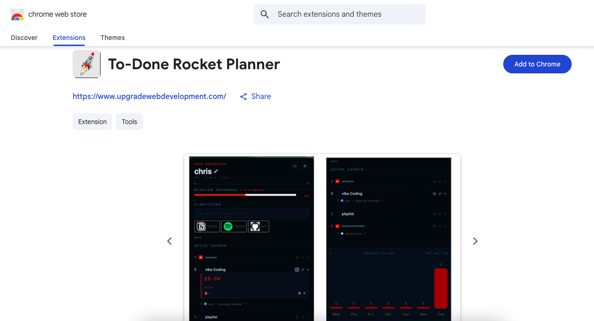
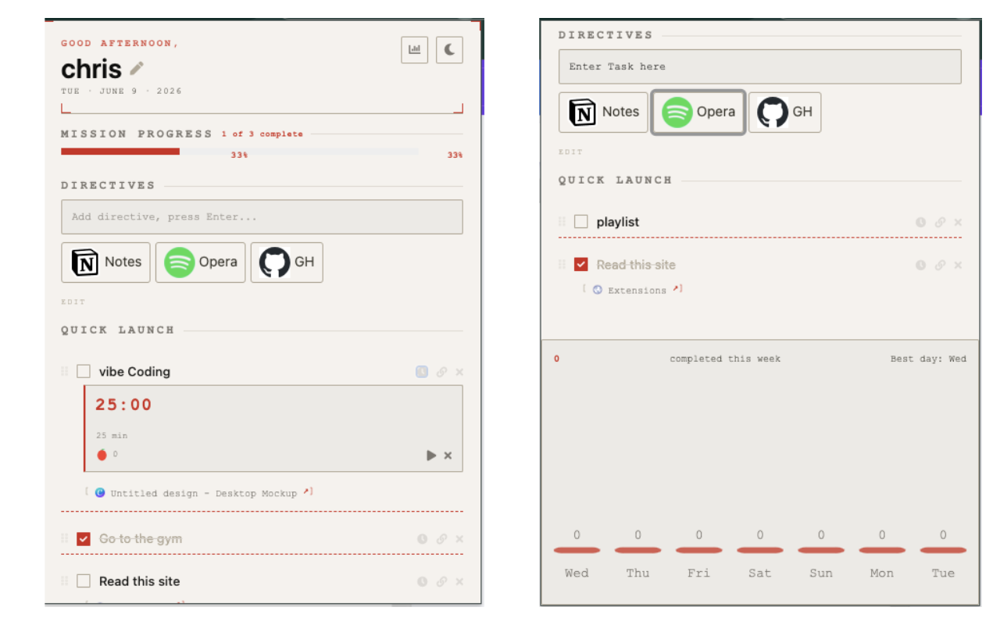
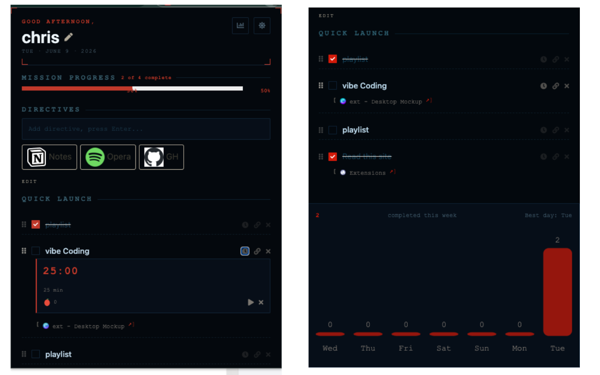

# To-Done Rocket Planner

A Chrome Extension Manifest V3 productivity dashboard for managing tasks, tracking progress, and using lightweight focus tools directly from the browser popup.

[Download the app on the Chrome Web Store](https://chromewebstore.google.com/detail/to-done-rocket-planner/hfgldicbgjfimghmaoefnhadmlebhcea)



## What It Does

To-Done Rocket Planner turns a new-tab style popup into a compact task workspace. It supports fast task capture, task completion tracking, quick actions, focus timers, weekly stats, and a dark mode preference that persists across sessions.

## Key Features

- Add, complete, edit, reorder, and delete task items
- Track mission progress with a live completion percentage
- Save and reuse quick action shortcuts
- Capture the current browser tab into a task
- Run focus sessions with a built-in timer and pomodoro count
- Show a temporary carry-over banner for focus session updates
- View weekly completion stats from the popup
- Toggle dark mode and keep the preference saved with Chrome sync storage
- Use time-based greeting states and dynamic header visuals

## Current UI

- `popup.html` contains the extension popup layout
- `popup.css` handles the retro-styled interface and dark theme overrides
- `js/script.js` drives task rendering, timer state, stats, banners, and theme persistence

## Screenshots

### Light Mode



### Dark Mode



## Tech Stack

- JavaScript
- HTML
- CSS
- Chrome Extension APIs
- `chrome.storage.sync` for persistent preferences and app state

## Project Structure

```text
.
├── manifest.json
├── popup.html
├── popup.css
├── js/
│   ├── background.js
│   ├── script.js
│   ├── action-items-utils.js
│   └── circle.js
├── images/
└── packages/
```

## Installation

1. Clone the repository.
2. Open `chrome://extensions/` in Chrome.
3. Enable Developer Mode.
4. Click Load unpacked.
5. Select the project folder.

## Permissions Used

- `storage` for saving tasks, preferences, and timer state
- `tabs` for capturing the current browser tab
- `alarms` for timer-related behavior
- `contextMenus` for browser interaction support

## Notes

- The extension uses Manifest V3.
- Dark mode is controlled from the popup header and persists across browser sessions.
- No cloud sync is included yet; state is kept locally through Chrome storage.

## Future Ideas

- Cloud sync across devices
- Task filtering and categorization
- Expanded theme customization
- Better analytics for task completion and focus sessions
